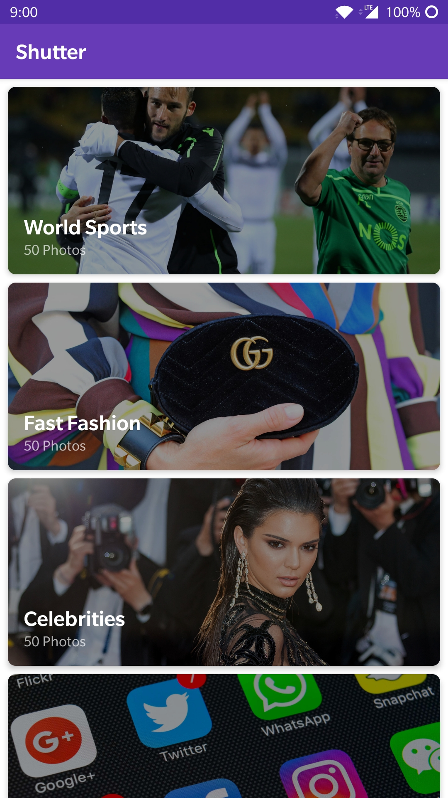

# Heimdall

 
A Shutterstock client with a beautiful material design interface.

Written in Kotlin, with MVVM architecture and data binding.

Works offline with a Room database

# Instructions
 
Shutterstock API requires user authorization. A test token is included in [gradle.properties](gradle.properties)

And [app-debug.apk](app-debug.apk) is included for testing.

# Screenshots

